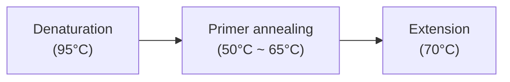

**Polymerase chain reaction** (PCR) is a technique for <span class="hi-green">replicating specific DNA sequences <u>outside cells</u></span>.

A small amount of DNA sample (<span class="hi-blue">DNA template</span>) can be <span class="hi-blue">amplified</span> to many copies quickly and accurately in order to <span class="hi-green">enhance detection</span>, which can be used for [[DNA fingerprinting|further analysis]] <u>(applications)</u>.

# Components
## Primers & dNTPs
**Primers** are short sequences of synthetic <span class="hi-green">single-stranded <u>DNA</u></span> complementary to one end of the <span class="hi-blue">target sequence</span>.

*Choosing appropriate primers*:
- Primers of suitable length (about <u>18 - 24 bases</u>) should be used.
	- Shorter primers have <span class="hi-green">fewer combinations of base sequences</span> and less variations, there is a higher chance for it to <span class="hi-green">anneal to wrong positions</span> of the DNA strand and produce <span class="hi-orange">inaccurate, non-specific</span> DNA amplification product.
	- Longer primers result in <span class="hi-green">slower annealing rate</span>.
- The nucleotide sequence of primers should point in the <span class="hi-green">direction</span> (3' or 5') which <span class="hi-blue">DNA extension</span> occurs.
- Two different primers (pointing toward one another) are needed, as a DNA template consists of <span class="hi-green">two strands</span>.

> [!tip] Length of primers
> - Shorter primers are used to amplify a small, simple fragment of DNA.
> - Longer primers are used to amplify an eukaryotic genomic DNA sample.

> [!warning]
> - Primers are <u>DNA molecules</u>, so it should not contain the base <u>uracil (U)</u>.

*Functions*:
- They bind to <span class="hi-green">one end of the target sequence</span> to mark the point where the synthesis of a new DNA strand starts.
- The target sequence to be amplified is <span class="hi-blue">'bracketed'</span>.

---

**Deoxyribonucleoside triphosphates (dNTPs)** are free nucleotides and building blocks of new DNA strands.

## DNA polymerase
**DNA polymerase** are enzymes that joins adjacent free complementary nucleotides.
- The enzyme needs to be able to withstand the <span class="hi-green">high temperature</span> (<span class="hi-orange">heat stable</span>) during PCR with high <span class="hi-blue">enzymatic activity</span>.

# Process


1. **Denaturation**
   <u>Heat</u> the reaction mixture (to about 95°C) to <span class="hi-green">denature</span> the DNA molecules so that the double helix <span class="hi-green">unwind</span> and separate into two <span class="hi-blue">single strands</span>.

2. **Primer annealing**
   <u>Cool</u> the reaction mixture (to between 50°C and 65°C) to allow <span class="hi-blue">primers</span> with <span class="hi-blue">complementary bases</span> to <span class="hi-green">anneal</span> to <u>each end</u> of the single-stranded DNA molecules.
   ```
   5'-GATCTGACTGATGCGTATGCTAGT-3'
               (primer 2) ATCA
   
      GATC (primer 1)
   3'-CTAGACTGACTACGCATACGATCA-5'
   ```

3. **Extension**
   Complementary free nucleotides (<span class="hi-orange">dNTPs</span>) join to the primer to <span class="hi-green">extend</span> the DNA molecule. <u>Temperature is raised</u> (to about 70°C) for <span class="hi-blue">DNA polymerase</span> to catalyse the <span class="hi-green">synthesis of new DNA strands</span>.
   ```
   5'-GATCTGACTGATGCGTATGCTAGT-3'
                  ...ATACGATCA
   
      GATCTGACT...
   3'-CTAGACTGACTACGCATACGATCA-5'
   ```

At the end of each cycle of PCR, the number of DNA strands is <span class="hi-green">doubled</span>.

> [!tip] Cycling of PCR
> Cycling of PCR can be performed automatically in a <span class="hi-blue">thermal cycler</span> by setting programmes to alter the number of PCR cycles performed, and the temperature and duration for the different stages of a cycle.
> 
> The amplified DNA fragments have to be <span class="hi-green">purified</span> before they are used for other purposes.
