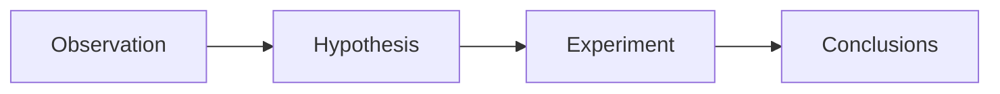

# Hypothesis & Prediction
**Hypothesis & prediction** is formed before an experiment. It helps to form an aim for an experiment to prove.

*Example*:
- Cell division resulted in the loss of organic materials, so an organism cannot develop into a complete organism from daughter cells. (HKDSE 2014 Paper 1B Q3)
- The hereditary information is stored in the food of the algal cell. (HKDSE 2016 Paper 1B Q8)
- The ability to roll one's tongue is determined by a single gene. (HKDSE 2017 Paper 1B Q10)

# Variables and measurements
## Independent variables
**Independent variables** are the factors under investigation, and is manipulated between set-ups.

*Examples*:
- Temperature or pH of reaction mixture for measuring the rate of [[Enzymes|enzymatic reactions]]
- Light intensity in measuring rate of [[transpiration]] of a plant

## Dependent variables
**Dependent variables** are the factors that changes according to the independent variable, and is the measurable result.

*Factors to consider when designing methods of measurement*:
- Accuracy
- Feasibility
- Reliability & validity

### Reliability & validity
![[reliability-validity.webp]]

*Definitions*:
- **Reliability** is about the consistency of a measurement, and its reproducibility under same conditions.
- **Validity** is about the accuracy of a measurement, whether they can represent what they are trying to measure.

*Improving experiment*:
- Conducting more experiments to minimize individual differences / reduce random errors
- Increasing sample size of study
- Controlling all other variables (control variables) that can affect the experiment
- Taking mean / median of experimental results

## Control variables
**Control variables** are all the other factors that may affect the dependent variables. They are kept constant to ensure the experiment is a <u>fair test</u>.

*Examples*:
- Temperature, humidity, wind speed
- pH of solution
- Volume and concentration of mixture
- Age, sex and health conditions

# Design considerations
## Multiple set-ups
- An **experimental set-up** is one in which the factor to be studied is <u>present</u>.
- A **control set**-up is one in which the factor to be studied is <u>absent</u>.

## Assumptions
*Definitions*:
- An assumption is something we think it is true, though we cannot be sure.
- A significant assumption is the one that the experiment cannot make any conclusion without assuming it to be true.

*Example*: Yeast bead catalase investigation
Aim of experiment is to investigate the effect of different types of heavy metal ions on the activity of yeast beads catalase under different concentrations.

**Unattained**:
- Environmental conditions are the same.
- Yeast beads have the same size and shape.

**Basic**:
- All catalases work the same.

**Good**:
- Amount of catalase in each yeast bead is the same.
- Catalase attains the same activity level initially.

**Excellent**:
- Oxygen release by yeast beads is only contributed by activity of catalase but not other enzymes.
- The oxygen bubbles released do not dissolve in hydrogen peroxide solution.
- Heavy metal ions do not affect the density of the solution which affect the travelling time of the yeast beads moving up to the solution surface.
- Respiration of yeast cells does not affect the pH of the solution.

## Precautions
*Refer to [[#Reliability & validity]].*

**Precautions** are procedures implemented to obtain valid data / in terms of its effect on the data collected / experimental design.

*Example*:
- A leafy shoot should be cut under water to prevent air bubbles from entering the xylem vessels and blocking water uptake. (in potometers)
- Using reactants of lower concentrations to ensure the measurement can be conducted in time / within allowed gradations.

## Limitations
**Limitations** are the practical or theoretical shortcomings of a study that are often outside of the researcher's control.

*Example*:
- A potometer can only measure the rate of water uptake.
- Some parts of beetroot tissue have more pigment in their cells than others. (beetroot experiment)
- The reactants may not be identical in size and shape, meaning some test tubes could contain slightly more reactants than others.

# References
- [HKDSE Biology SBA Teachers’ Conference (2023/2024)](https://www.hkeaa.edu.hk/DocLibrary/SBA/HKDSE/ConfDoc-BIO-1023-04.pdf) (page 30)
- [HKDSE Biology SBA Teachers’ Conference (2022/2023)](https://www.hkeaa.edu.hk/DocLibrary/SBA/HKDSE/ConfDoc-BIO-1122-01.pdf) (page 4 - 6)
- [Seminar on School Based Assessment (Biology)](https://www.hkeaa.edu.hk/DocLibrary/SBA/HKDSE/Powerpoint-BIO-0423-01.pdf)
