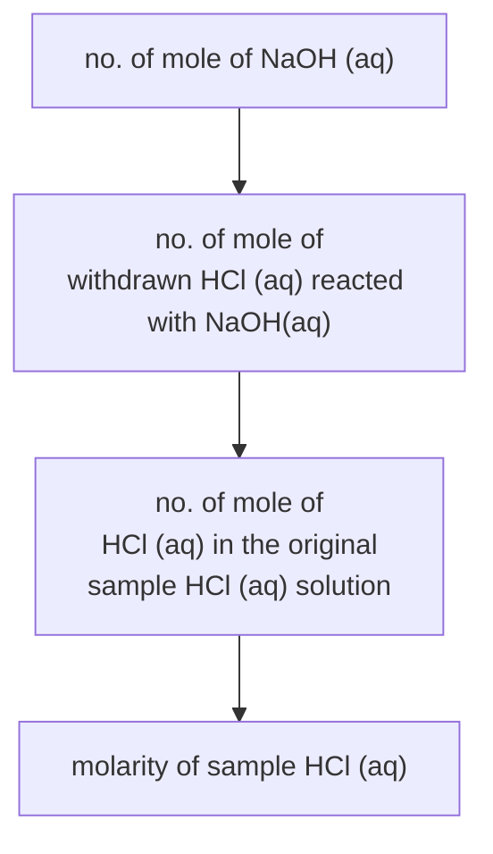

# Concepts
*Refer to: [[Acids and Bases]]*

## Definitions
[[Introduction to acids]]:
- **Acid**: An acid ionizes in water to give hydrogen ion as the <u>only cation</u>.
- **Basicity** is the maximum amount of ionizable hydrogen atom in an acid molecule.

[[Introduction to bases and alkalis]]:
- **Alkali** is a water <u>soluble</u> substance (/ base) reacting with an <u>acid</u> to give <u>salt and water only</u>. / Alkali is a substance when <u>dissolved in water</u> to give <u>hydroxide ions</u> as the <u>only anion</u>. (HKDSE 2020 Paper 1B Q7(b))
- **Base**: A base reacts with an acid to give salt and water only.
- **Neutralization** is a chemical reaction where an acid reacts with a base to produce salt and water as the <u>only</u> products.

[[Strength of acid and alkali]]:
- **Strength of acid / alkali**: The strength of an acid / alkali depends on the degree of ionization / dissociation of that acid / alkali.
- **Strong acid**: A strong acid <u>completely ionizes</u> in water to give hydrogen ion as the only cations.
- **Weak acid**: A weak acid <u>partially ionizes</u> in water to give hydrogen ion as the only cations.
- **Strong alkali**: A strong alkali <u>completely dissociates</u> in water to give hydroxide ion as the only anion.
- **Weak alkali**: A weak alkali <u>partially dissociates</u> in water to give hydroxide ion as the only anion. ("ionize" for ammonia)

[[Concentration and molarity of solution]]:
- **Concentrated solution**: A concentrated solution is a solution with a <u>high amount</u> of solute dissolved in the solvent.
- **Saturated solution**: A saturated solution is a solution that has <u>dissolved all the solute</u> it can at a given temperature.
↪ *See also: [[Crystallization]]*

[[pH scale, acidity and alkalinity]] / [[Acid-base Indicators]]:
- **Acidic environment**: $\ce{[H+(aq)] > [OH-(aq)]}$
- **Neutral environment**: $\ce{[H+(aq)] = [OH-(aq)]}$
- **Alkaline environment**: $\ce{[H+(aq)] < [OH-(aq)]}$
- **End-point**: End-point is the moment when an <u>acid-base indicator changes its colour</u>.
- **Equivalence point**: Equivalence point is the moment when the <u>reaction has just completed</u>.

## Processes & Designs
### Acid-alkali titration
![[Acid-alkali titration#Procedure]]

# Important questions
## Acid-base titration experiment
The molarity of a sample of $\ce{HCl(aq)}$ is determined. $\pu{10.0 cm3}$ from the original sample of $\pu{25.00 cm3}$ of the $\ce{HCl(aq)}$ is withdrawn, then a few drops of acid-base indicator are added. The mixture is titrated against $\pu{2.35 mol dm-3} \; \ce{NaOH(aq)}$. It is found that $\pu{25.0 cm3}$ is needed to reach the end point of reaction.

(a) Suggest a suitable acid-base indicator for the solution. State the colour change when the end point is reached.

**Answer**:
- Methyl orange / phenophthalein (exact wording)
- The solution turns from <u>red</u> to <u>orange</u>. / The solution turns from <u>colourless</u> to <u>very pale pink</u>.
---
(b) Calculate the molarity of the sample $\ce{HCl(aq)}$.

**Answer**:
- No. of moles of $\ce{NaOH(aq)}$ used = 2.35 x 25.0/1000 = 0.05875 mol
- Concentration of the sample of $\ce{HCl(aq)}$
  = 0.05875 x (25.0/10.0) / (10.0/1000)
  = 14.7 ($\pu{mol dm-3}$)
  
  (Correct Unit. Accept $14.69,\;14.70\;(\pu{mol dm-3})$)
  (Do not accept $\pu{14.6875 mol dm-3}$)

## Neutralization: Temperature & Electrical Conductivity
*See also: [[Neutralization#Change in temperature and electrical conductivity]]*

## HKCEE 2010 Paper 1 Q10(d)
With reference to the below graph, explain the temperature change of the mixture throughout the experiment when sulphuric acid is added into sodium hydroxide solution.
![[2010_q10(d).webp|]]

**Answer**:
- As <u>neutralisation</u> is <u>exothermic</u>, temperature of the solution rose when sulphuric acid was added into sodium hydroxide solution.
- When the sodium hydroxide was just <u>completely reacted</u>, the temperature reached a <u>maximum value</u>.
- After that, the <u>addition of excess</u> (cold) sulphuric <u>acid</u> <u>lowered</u> the temperature of the reaction mixture.

## HKDSE 2017 Q1(c)(i, ii) Modified
An experiment was carried out to study the change in electrical conductivity of the mixture formed when a dilute $\ce{H2SO4(aq)}$ was added gradually to a fixed volume of a dilute $\ce{Ba(OH)2(aq)}$. The graph below shows the results of the experiment.

![[2017_q1c.webp|450]]

Explain the change of electrical conductivity from A to B, then from B to C.

**Answer**:
- When $\ce{H2SO4(aq)}$ is added, $\ce{BaSO4(s)}$ and $\ce{H2O(l)}$ are formed, the <u>concentration of mobile ions in the mixture decreases</u>.
- When the dilute $\ce{Ba(OH)2(aq)}$ is just <u>completely reacted</u>, the electrical conductivity reaches a <u>minimum value</u>.
- The addition of excess sulphuric acid <u>increases the concentration of mobile ions in the reaction mixture</u>, the electrical conductivity increases.
