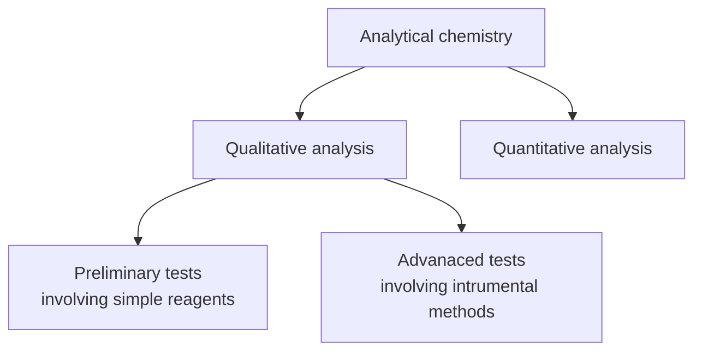

**Analytical methods** can be divided into:
- **Qualitative analysis**: <u>Identification of a particular substance</u> in a sample.
- **Quantitative analysis**: <u>Determining amount</u> of particular substance in a sample.

#### Sections
- Quantitative analysis
	- [[Inorganic preliminary tests]]
	- [[Organic preliminary tests]]
	- [[Advanced tests]]
- Quantitative analysis

