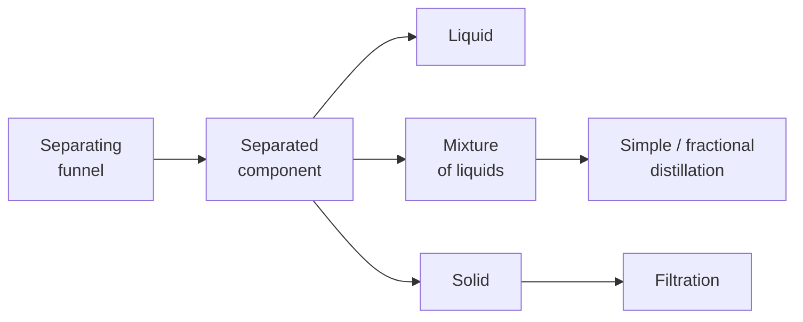

**Liquid-liquid extraction**, also **solvent extraction**, is a process to extract substance from one liquid to another liquid. The liquids used must be immiscible. A [[separating funnel]] is used for this extraction process.

#### Experimental procedure
![[liquid_liquid_extraction.webp]]
Consider the extraction of iodine from aqueous iodine solution (brown in colour) in heptane (purple in colour):
- Iodine is more soluble in organic solvents than in aqueous solvents.
- (a): Water and heptane is immiscible, they remain as two separate layers. 
- (b): After shaking, most of the iodine will dissolve into the heptane layer.
- Then, the tap is opened to run off the lower aqueous layer and the top layer of iodine dissolved in heptane can be obtained.
- Traces of water can be removed by adding drying agents (e.g. anhydrous $\ce{Na2SO4}$, anhydrous $\ce{CaCl2}$) and then filtered.
- The iodine dissolved in heptane can be further [[Fractional distillation|distilled]] to obtain iodine solid, as <u>heptane has a lower boiling point than iodine solid</u>.

> [!tip]
> In the above experiment, haptane is less dense than water and forms the upper organic layer, while water forms the lower aqueous layer. <u>However, students are not expected to deduce this.</u>

> [!warning]
> - The tap should be opened occasionally to remove vapour pressure, otherwise the stopper may be pushed away.
> - The stopper should be removed before running off the liquid from the separating funnel, otherwise the liquid may not run.

##### Additional steps

##### Descriptions
**Example**: HKDSE 2016 Paper 2 Q3(c)(ii)(1)
X and Y are isomeric compounds with their structures shown below:
![[16_dse_q3c.webp|300]]

Both of them are insoluble in water but soluble in dichloromethane. When treated with dilute $\ce{Na2CO3(aq)}$, no reaction occurs for X but reaction occurs for Y to form a soluble salt.

You are provided with dilute $\ce{Na2CO3(aq)}$ and dilute $\ce{H2SO4(aq)}$. Outline an experimental procedure, based on solvent extraction, to separate solid Y from a solution of X and Y in dichloromethane.

**Solution**:
- Add $\ce{Na2CO3(aq)}$ (in excess) into X and Y in dichloromethane.
- Transfer the mixture into separating funnel. Shake thoroughly. (The mixture is allowed to settle.)
- Run off to obtain aqueous layer which contains salt (/ anion) of Y.
- Add dilute $\ce{H2SO4(aq)}$ into the aqueous later until no more precipitate is formed.
- Filter to obtain the solid Y.

> [!tip]
> When Y reacts with $\ce{Na2CO3(aq)}$, a sodium salt is produced. Addition of an acid is to reform the original organic compound.

