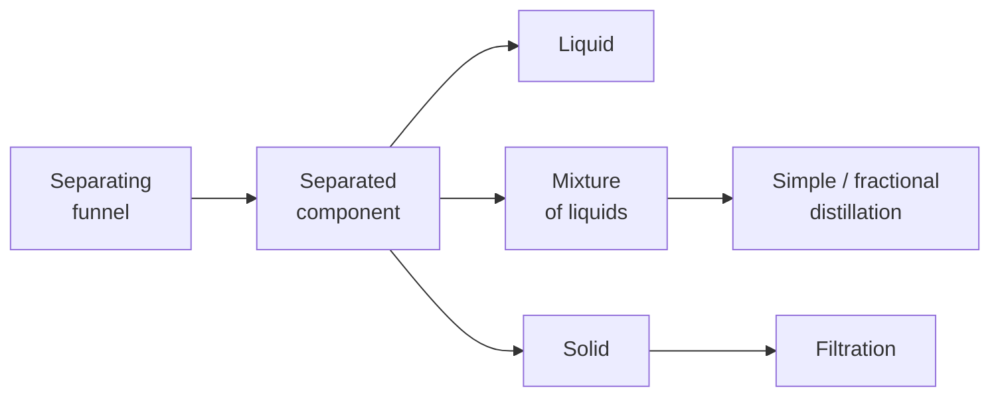

**Separating funnel** is used in organic synthesis for separating substances with different states / immiscible liquids (organic & aqueous).

#### Procedures

```mermaid
flowchart LR
SS[Separating<br>funnel];
SP[Separated<br>component];
SS --> SP;

A[Liquid];
B[Mixture<br>of liquids];
C[Solid];
SP --> A;
SP --> B;
SP --> C;

F[Filtration];
S[Simple / fractional<br>distillation];
C --> F;
B --> S;
```

//TODO add examples