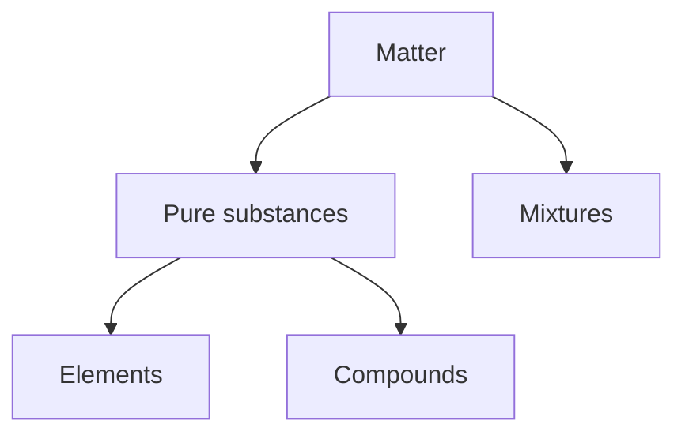

Matter is anything that has a <u>mass</u> and <u>occupies space</u>. It can be classified into pure substance and mixture.

> [!note]
> Comparing pure substances and mixture, pure substances would have sharp physical properties (such as boiling point and melting point) while mixtures do not.

# Pure substances
**Pure substances** are <u>single substances</u> that has nothing else mixed with it.

*Examples*:
- Copper ($\ce{Cu}$)
- Chlorine ($\ce{Cl2}$)
- Distilled water ($\ce{H2O}$)

## Elements
**Elements** are substances which <u>cannot be broken down into anything simpler by chemical methods</u>. Substances that can be broken down into simpler substances by electricity, for example, are not elements.

*Examples*:
- Carbon ($\ce{C}$)
- Aluminium ($\ce{Al}$)
- Copper ($\ce{Cu}$)

## Compounds
**Compounds** are substances composed of <u>two or more elements chemically joined together</u>. They can be broken down into simpler substances by chemical methods.

*Examples*:
- Sodium chloride ($\ce{NaCl}$)
- Water ($\ce{H2O}$)
- Ammonia ($\ce{NH3}$)

# Mixtures
**Mixtures** consists of <u>two or more pure substances</u> which are <u>not chemically joined together</u>. Different pure substances in mixtures can be <u>separated by a physical method</u>.

*Examples*:
- Soda water ($\ce{CO2}$ and $\ce{H2O}$)
- Wine ($\ce{H2O}$, $\ce{C6H12O6}$, $\ce{CH3CH2OH}$ and other substances)
- Rock salt ($\ce{NaCl}$, $\ce{SiO2}$ and other substances)

