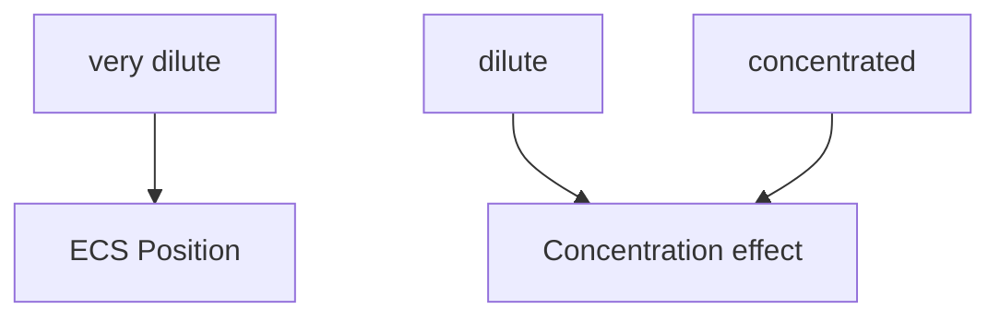

**Electrolysis** is a chemical process in which electricity is supplied in order to force the redox reaction to occur, converting electrical energy to chemical energy.
- The cell undergoing electrolysis is called electrolytic cells.

> [!warning] Attraction of ions between electrodes
> Since electricity is supplied intentionally, charges are created in the electrolytic cell. In the electrolyte, cations will be attracted towards the negative electrode, while anions will be attracted towards the positive electrode.
> 
> However, this is not the case in chemical cells, as it involves the creation of charges by supply electricity to force reactions to occur.

**Basics of electrolysis**:
- The electrolytic cell must be connected to an electricity supply (e.g. chemical cell, battery or D.C. supply), with the positive terminal connected to the positive electrode, and vice versa.

- When the electrolysis process involves aqueous solutions, consider the self-ionization of water: $\ce{H2O(ℓ) <=> H+(aq) + OH-(aq)}$

> [!warning] Types of electrolytes
> Aqueous electrolytes contain water, so the self-ionization of water is considered. However, water will not be present in molten electrolytes. The mobile ions in the molten electrolyte will be in liquid state.

#### Basic process
Consider the electrolysis of molten lead(II) bromide using graphite electrodes:
![[electrolysis_molten_pbbr2.webp|700]]

Solid lead(II) bromide is heated in the crucible until it turns molten.
- **Ions present**: $\ce{Pb^2+(ℓ)}$, $\ce{Br^-(ℓ)}$
- **At cathode**: $\ce{Pb^2+(ℓ) + 2e- -> Pb(ℓ)}$
- **At anode**: $\ce{2Br^-(ℓ) -> Br2(ℓ) + 2e-}$
- **Overall equation**: $\ce{PbBr2(ℓ) -> Pb(ℓ) + Br2(ℓ)}$

#### Selection of electrodes
**Reactive electrodes**: (e.g. $\ce{Cu(s)}$)
- These electrodes may participate in the reaction, so they should be considered when determining the electrolysis process.

**Inert electrodes**: (e.g. platinum, graphite)
- These electrodes do not participate in the reaction.

> [!warning] Usage of platinum
> - Platinum electrodes are readily attacked by halogens and halide ions, they must not be used for such reactions.

#### Factors affecting preferential discharge
##### ECS position of ions
*Pre-context: [[Electrochemical series]]*

**Examples**:
- [[Electrolysis of very dilute sodium chloride solution]]
	- [[Hoffman voltameter]]
- [[Electrolysis of dilute copper(II) sulphate solution]]

##### Concentration of ions
> [!warning]
> - This factor mainly affect the <u>discharge of anions</u>.
> - Specifically, $\ce{Cl-(aq)}$, $\ce{Br-(aq)}$  and $\ce{I-(aq)}$.

- In a very dilute solution, the anions have concentration lower than hydroxide ions, so they are discharged according to the ECS position.
- In a dilute or concentrated solution, the anions have concentration higher than hydroxide ions, so the anions are preferentially discharged.

**Examples**:
- [[Electrolysis of concentrated sodium chloride solution]]

##### Nature of electrodes
###### Anodes
When copper or metals higher in the ECS (higher than hydroxide ion) are used an anode, they are preferentially discharged to give metal ions.

> [!warning]
> - When copper is used as a cathode, it will not be discharged as copper cannot be reduced further.
> - Lithium, potassium, calcium and sodium cannot be used as an electrode, as they would react with water readily.

**Examples**:
- [[Carbon-copper electrode electrolysis]]

###### Cathodes
When mercury is used as the cathode in electrolysis of concentrated sodium chloride solution, it favours the discharge of sodium ion.

**Examples**:
- [[Electrolysis of sodium chloride solution with mercury]]
- [[Chloroalkali industry]]

#### Determination of Preferential Discharges
**Order for determination**:

**Example**: HKDSE 2021 Paper 1B Q2
![[dse2021_1b_q2.webp|700]]

**Answer**:
![[dse2021_1b_q2_marking.webp|640]]

#### Industrial Applications of Electrolysis
1. [[Extraction of metals#Electrolysis of molten metal ore]]
2. [[Corrosion of aluminium#Anodization of aluminium objects]]
3. [[Protection of metals#Cathodic protection]]
4. [[Electroplating]]
