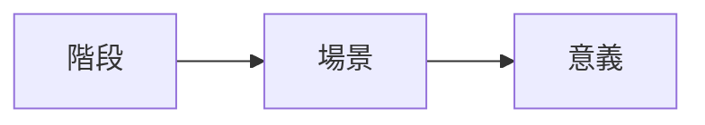

> **題目**:
> 「一則寓言寫到，一位巴格達商人聽從神的旨意，彎腰撿拾石子，結果石子變成了寶石。其實，彎腰是每個人常有的勞動; 農民彎腰耕作，換來了豐收的喜悅; 清潔工人的彎腰，換來了環境的清潔。彎腰是勞動，是勤勉，是吃苦，是學習。當然，彎腰有時也意味著奴顏婢膝，屈膝投降，丧失人格。」結合上文參考，以「彎腰」為題，寫文章一篇。

# 拆題
1. 需要扣合動作，動作背後意義，投射價值觀
2. 包含正面負面

# 題材
## 記敘文
1. **父母為農民** 
   記敘農民如何藉助彎腰，而播種收成，從而帶出對於農民的讚賞，鄉土之情，自然反思，甚或如何哺育你成人。

2. **父母為清潔工人**
   記敘清潔工人如何彎腰掃地，帶出對其奉獻之肯定，維繫社區之乾淨，且默默奉獻，養大你。

3. **上班彎腰**
   記敘自己日常上班時，從不妥協，到後來彎腰向客人以保持銷量，彎腰向上司以討好對方，最後帶出彎腰利弊參半，是處世價值觀，也是一種無可奈何的退讓。

## 散文

1. 青年彎腰向老師請教問題，彎腰之意義在於謙虛以對，虛心學習
2. 成年彎腰向工作謀求生活，呈現如何彎腰向誰?其意義為一種人世法則
3. 中年彎腰向子女哺育長大，呈現如何彎腰照顧孩子? 意義是無私奉獻的愛
4. 老年彎腰向天命，等待死亡，也看破死亡。呈現自己彎腰過日，但心靈並不彎腰，挺直以對，無懼生死。

## 議論文
1. **定義**
2. **正面意義**: 請教他人、禮貌之舉、發掘萬物、奉獻自我
3. **負面意義**: 為求名利彎腰則不可，諂媚以對權勢也不可
4. **自處**: 彎腰向世人是仁者的愛「橫眉冷對千夫指，俯首甘為孺子牛」
